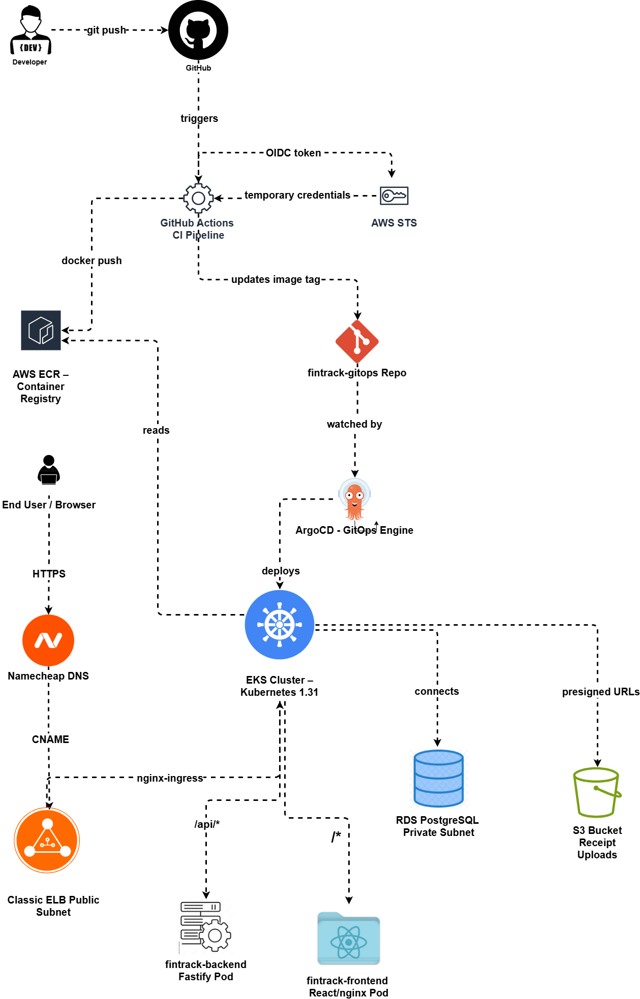

# FinTrack Infrastructure

GitOps infrastructure for [FinTrack] - a personal finance tracker deployed on AWS EKS with a complete DevOps pipeline: Terraform-provisioned infrastructure, GitOps delivery via ArgoCD, canary deployments via Argo Rollouts, policy enforcement via Kyverno, live secrets via External Secrets Operator, and end-to-end observability using Prometheus, Loki, Alertmanager, and Grafana.

## Architecture Overview



## Stack

| Layer                | Technology                                             |
| -------------------- | ------------------------------------------------------ |
| Cloud                | AWS (EKS, RDS, S3, ECR, IAM, IRSA, Secrets Manager)    |
| IaC                  | Terraform (modular, remote state, feature-based files) |
| Orchestration        | Kubernetes 1.31 on EKS (5-node, t3.small)              |
| CI                   | GitHub Actions with OIDC (no stored credentials)       |
| CD                   | ArgoCD (pull-based GitOps)                             |
| Progressive Delivery | Argo Rollouts (canary: 20% → 50% → 100%)               |
| Policy Enforcement   | Kyverno (image trust, non-root containers)             |
| Secrets              | External Secrets Operator + AWS Secrets Manager        |
| TLS                  | AWS ACM (terminated at ELB)                            |
| Ingress              | nginx-ingress + Classic ELB                            |
| Monitoring           | Prometheus + Alertmanager + Grafana                    |
| Logging              | Loki + Promtail                                        |
| DNS                  | Route 53                                               |
| DB Migrations        | Prisma Migrate via Kubernetes Job in CI                |

## Repository Structure

```
fintrack-infrastructure/   - this repo - Terraform modules
fintrack-gitops/           - Kubernetes manifests (ArgoCD watches this)
fintrack-frontend/         - React + Vite application
fintrack-backend/          - Node.js + Fastify + Prisma API
```

| Repo                                                             | Description                               |
| ---------------------------------------------------------------- | ----------------------------------------- |
| [fintrack-frontend](https://github.com/qezman/fintrack-frontend) | React + Vite frontend                     |
| [fintrack-backend](https://github.com/qezman/fintrack-backend)   | Fastify + Prisma + PostgreSQL API         |
| [fintrack-gitops](https://github.com/qezman/fintrack-gitops)     | GitOps manifests - ArgoCD source of truth |

## Key Engineering Decisions

- **GitOps over push-based CD** - ArgoCD pulls from Git rather than CI pushing to the cluster. Deployments are auditable, reversible, and drift is auto-corrected.
- **OIDC over stored credentials** - GitHub Actions assumes an IAM role via OpenID Connect. No AWS keys stored anywhere.
- **IRSA over instance profiles** - Backend pod and External Secrets Operator each assume scoped IAM roles. Access is pod-specific, not node-wide.
- **External Secrets over Sealed Secrets** - Secrets are fetched live from AWS Secrets Manager at runtime via IRSA. Nothing sensitive touches Git; rebuilding the cluster requires no re-encryption step.
- **Canary deployments (Argo Rollouts) over plain rolling updates** - New backend versions receive 20% → 50% → 100% of traffic with pauses for verification before full promotion.
- **Policy-as-code (Kyverno)** - Cluster-wide admission rules block non-ECR images and containers without a non-root security context.
- **AWS ACM over cert-manager + Let's Encrypt** - TLS terminates at the load balancer and renews automatically.
- **Modular Terraform** - Each infrastructure component is an independent module; bootstrap resources are split into feature-based files rather than one monolithic file.
- **HPA over fixed replicas** - Backend scales 2–5 replicas on CPU (70%) and memory (80%) utilization.
- **Kubernetes Job for migrations** - Prisma migrations run as a CI-owned Job inside the cluster on every push, not tracked in GitOps since it's ephemeral.
- **Multi-channel Alertmanager routing** - Critical → Discord, warning → Email + Telegram, info → Slack.

## Infrastructure Components

| Component       | Details                                                                    |
| --------------- | -------------------------------------------------------------------------- |
| VPC             | 10.0.0.0/16, 2 public + 2 private subnets across us-east-1a and us-east-1b |
| EKS             | Kubernetes 1.31, t3.small nodes (5), managed node group                    |
| RDS             | PostgreSQL 16, db.t3.micro, private subnets only                           |
| S3              | Private bucket for receipt uploads, presigned URL access                   |
| ECR             | Private image registry, 10-image lifecycle policy                          |
| Secrets Manager | Backend credentials (DATABASE_URL, JWT_SECRET), pulled via IRSA            |

## Remote State

Terraform state is stored remotely in S3 with DynamoDB locking:

```
S3 Bucket:      terraform-fintrack-state-<account-id>
DynamoDB Table: fintrack-terraform-locks
Region:         us-east-1
```

## CI/CD Pipeline

```
Push to main
  → Build Docker image
  → Push to ECR
  → Run Prisma migration Job inside cluster (VPC access to RDS)
  → Wait for migration to complete
  → Update image tag in fintrack-gitops
→ ArgoCD detects change
→ Argo Rollouts progresses canary (20% → 50% → 100%)
→ Kyverno validates the new pod on admission
```

## Observability

- **Prometheus** - scrapes cluster and app metrics via kube-prometheus-stack
- **Loki + Promtail** - log aggregation, one Promtail pod per node
- **Alertmanager** - routes alerts by severity: critical → Discord, warning → Email + Telegram, info → Slack
- **Grafana** - dashboards for cluster health, pod resources, and alert status
- **Custom PrometheusRule** - alert rules defined as code, version-controlled in Git

## Security & Policy

- **Kyverno** - `disallow-root-containers` and `restrict-image-registries` cluster policies, currently in Audit mode
- **External Secrets Operator** - live secret sync from AWS Secrets Manager, no secrets stored in Git

## Getting Started

### Prerequisites

- AWS CLI configured with appropriate IAM permissions
- Terraform >= 1.5.0
- kubectl
- Helm >= 3.0
- kubectl-argo-rollouts CLI plugin

### Phase 1 - Infrastructure

```bash
cd environments/dev

> **Note (WSL users):** If Terraform fails with TLS handshake timeout errors, run:
> `export SSL_CERT_FILE=$(python3 -c "import certifi; print(certifi.where())")`
> before applying.

# Phase 1: AWS infrastructure only
terraform apply \
  -target=module.vpc \
  -target=module.eks \
  -target=module.rds \
  -target=module.s3 \
  -target=module.iam \
  -auto-approve

# Reconnect kubectl
aws eks update-kubeconfig --name fintrack-dev --region us-east-1

# Phase 2: Cluster bootstrap (ArgoCD, nginx-ingress, monitoring, Loki,
# Kyverno, External Secrets Operator, Argo Rollouts)
terraform apply -auto-approve
```

### Phase 2 - GitOps

```bash
# Grant cluster access
aws eks create-access-entry \
  --cluster-name fintrack-dev \
  --principal-arn arn:aws:iam::<account-id>:user/eks-project-user \
  --region us-east-1 2>/dev/null || true

aws eks associate-access-policy \
  --cluster-name fintrack-dev \
  --principal-arn arn:aws:iam::<account-id>:user/eks-project-user \
  --policy-arn arn:aws:eks::aws:cluster-access-policy/AmazonEKSClusterAdminPolicy \
  --access-scope type=cluster \
  --region us-east-1

# Apply ArgoCD application manifests
kubectl apply -f fintrack-gitops/apps/frontend.yaml
kubectl apply -f fintrack-gitops/apps/backend.yaml
kubectl apply -f fintrack-gitops/apps/cluster.yaml
```

### Phase 3 - Secrets

```bash
# Store/update backend secret in AWS Secrets Manager
aws secretsmanager put-secret-value \
  --secret-id fintrack-dev-backend-secrets \
  --secret-string '{"DATABASE_URL":"postgresql://fintrack_admin:<password>@<rds-endpoint>:5432/fintrack","JWT_SECRET":"<your-jwt-secret>"}' \
  --region us-east-1

# Apply the ClusterSecretStore and ExternalSecret
kubectl apply -f fintrack-gitops/manifests/backend/secretstore.yaml
kubectl apply -f fintrack-gitops/manifests/backend/externalsecret.yaml

kubectl get externalsecret -n fintrack
```

### Phase 4 - Database

```bash
# Migrations run automatically via CI on every push to main.
# To run manually:
kubectl run prisma-migrate \
  --image=<account-id>.dkr.ecr.us-east-1.amazonaws.com/fintrack-backend:latest \
  --restart=Never \
  --namespace=fintrack \
  --overrides='{"spec":{"containers":[{"name":"prisma-migrate","image":"<account-id>.dkr.ecr.us-east-1.amazonaws.com/fintrack-backend:latest","command":["npx","prisma","migrate","deploy"],"envFrom":[{"secretRef":{"name":"fintrack-backend-secrets"}}]}],"serviceAccountName":"fintrack-backend"}}'
```

## Monitoring

```bash
# Grafana
kubectl port-forward -n monitoring svc/kube-prometheus-stack-grafana 3000:80

# Prometheus
kubectl port-forward -n monitoring svc/prometheus-operated 9091:9090

# Alertmanager
kubectl port-forward -n monitoring svc/alertmanager-operated 9093:9093

# Argo Rollouts dashboard
kubectl port-forward svc/argo-rollouts-dashboard -n argo-rollouts 3100:3100
```

- Grafana: `http://localhost:3000` - username: `admin` | password: `fintrack-grafana-2025`
- Prometheus: `http://localhost:9091`
- Alertmanager: `http://localhost:9093`
- Argo Rollouts: `http://localhost:3100`

> Destroy when not in use: `terraform destroy -auto-approve`

## NB

`-target` is used only for the Phase 1 → Phase 2 bootstrap split, where the Kubernetes provider requires the EKS cluster to exist first. Not used for routine changes - regular `terraform apply` is preferred once the cluster is bootstrapped.

## Documentation

Full setup guide, architecture decisions, and redeployment walkthrough:

[FinTrack Platform Documentation](https://polarized-boater-990.notion.site/FinTrack-EKS-Platform-38d604d0a68980168e51cf384b92a454)

## Author

**Kazeem**
